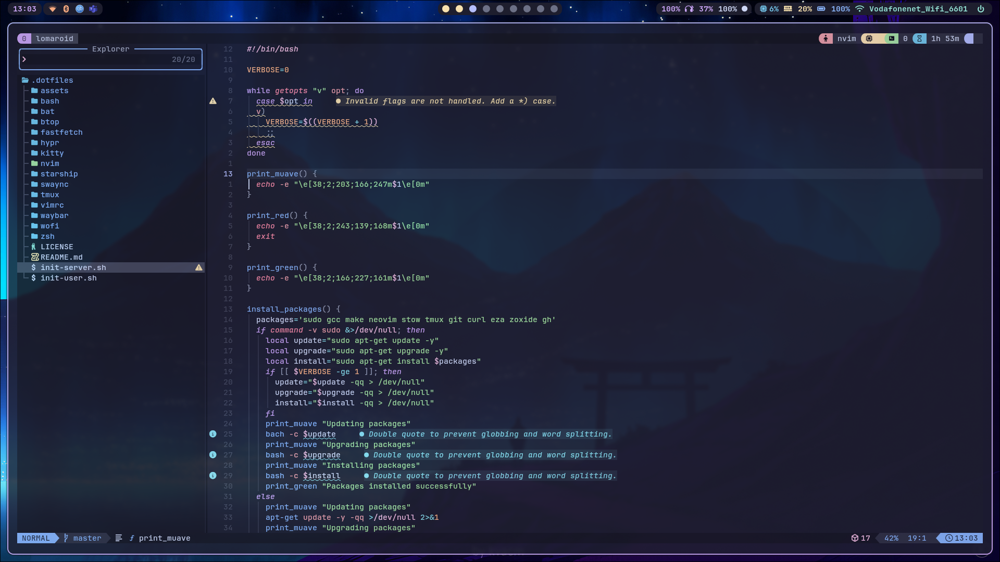

## Quick Start

### Servers

```bash
curl -sSL https://dot.farukerdem.page/server |bash
```

### Desktep Users

```bash
curl -sSL https://dot.farukerdem.page/user |bash
```

## Wallpapers

[farukerdem34/catppuccin-wallpapers](https://github.com/farukerdem34/catppuccin-wallpapers)

## GTK Theme & Icons

[Fausto-Korpsvart/Catppuccin-GTK-Theme](https://github.com/Fausto-Korpsvart/Catppuccin-GTK-Theme.git)

## Cursor

<https://www.gnome-look.org/p/2260616>

## NixOS

```bash
nix-shell -p git stow gcc # Get nix-shell first

mv $HOME/.bashrc{,.bak}

mv $HOME/.bash_aliases{,.bak}

stow bash\
bat\
btop\
fastfetch\
hypr\
kitty\
nvim\
starship\
swaync\
tmux\
vimrc\
waybar\
wofi\
zsh

sudo mv /etc/nixos/configuration.nix{,.bak}
sudo stow -t / nixos
```
