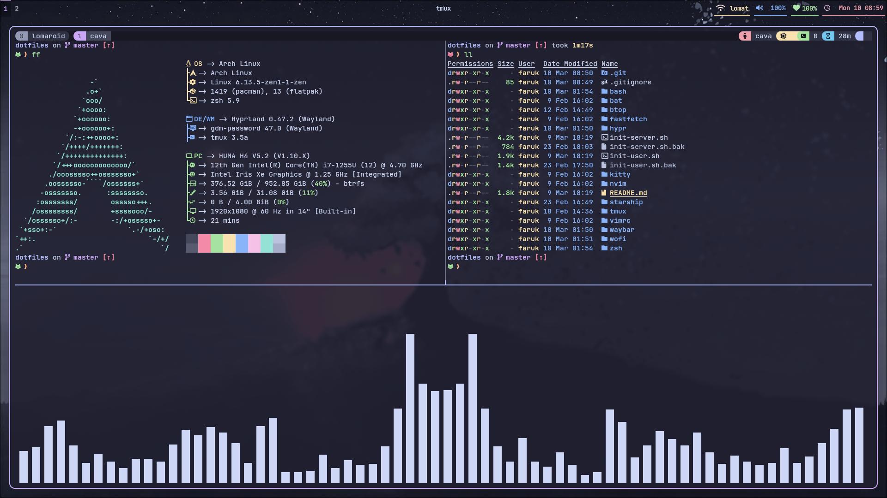

<div align="center">

      
</div>




## Quick Start

```bash
curl -sSL https://dot.farukerdem.page|bash
```

## Dependecies

```bash
sudo apt update -y;sudo apt upgrade -y;sudo apt install stow neovim tmux bat fzf git gcc -y
```

```bash
sudo pacman -Syu --noconfirm --color always stow neovim tmux bat fzf git gcc btop
```

## Dotfiles

```bash
git clone https://github.com/farukerdem34/dotfiles.git $HOME/.dotfiles
cd $HOME/dotfiles/
stow bat fastfetch kitty nvim tmux vimrc zsh
~/.tmux/plugins/tpm/bin/install_plugins
nvim --headless "+Lazy! sync" +qa
. ~/.zshrc
```

#### For Desktop Users

```bash
git clone https://github.com/farukerdem34/dotfiles.git ~/.dotfiles
cd ~/.dotfiles/
bash init-user.sh

```

#### For Servers

```bash
git clone https://github.com/farukerdem34/dotfiles.git ~/.dotfiles
cd ~/.dotfiles/
bash init-server.sh
```

## Wallpapers

[farukerdem34/catppuccin-wallpapers](https://github.com/farukerdem34/catppuccin-wallpapers)

## GTK Theme & Icons

[Fausto-Korpsvart/Catppuccin-GTK-Theme](https://github.com/Fausto-Korpsvart/Catppuccin-GTK-Theme.git)

## Cursor

<https://www.gnome-look.org/p/2260616>
